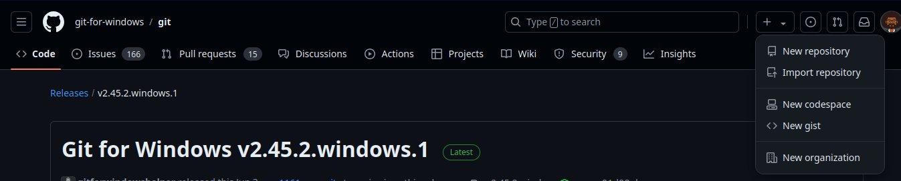

### Your First Git Repository

---

This course uses commands in Linux to do simple operations.

Open Gitbash in your working directory and run the commands. The commands 

should work on your environment.

For example the following unix command is shown further down in the course:

    echo "Hello World" > hello.txt

The command creates a file called hello.txt with the words "Hello World" in it.

To do the equivalent in windows you can use notepad to create the file.

#### Git Repositories

There is an open source repository where you can play with git called: 

    github.com. 

On github.com you can create your own repositories for free.  They support public   

repositories that the whole world can see but they have recently introduced private 

ones where you can decide who can see the code.

For the purposes of this course you should create a new private repository on github.com. 

 Create the repository under your github username.

Instructions:

    (i) Use a lower case username when you create an account.
    
        Once you have registered and logged into github.com
    
        Look for a + on the top right hand side of the browser window near your github user icon.
    
        Click `"New Repository"`
    
        Choose your owner in the dropdown and name your repository:
    
            `[Your Initials]_phoenix_git_course`
    
        For example if your name is:
    
            Wilberforce Shirandula
    
        You repository could be called:
    
            `wb_learning_git`
    
    (ii) For description write:
    
        [Your Name] Phoenix Git Course
    
    (ii) Choose the private option
    
    (iii) Click the checkbox for Add .gitignore and choose the "Java" template.
    
          Leave the "Add a README file" and "Choose a license" checkboxes unchecked. 
    
    (iv) Click Create repository

#### Sample Screenshot

